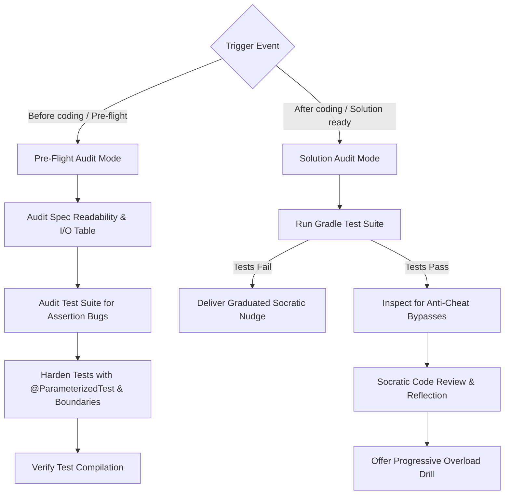

# MOOC Exercise Audit and Verification

This skill acts as the quality gate for an individual exercise. It runs in two modes:
1. **Pre-flight Audit:** Run before the learner starts coding to audit the exercise spec markdown and harden the JUnit 5 test suite with parameterized boundary tests and zero assertion bugs.
2. **Solution Audit:** Run when the learner announces completion to verify the implementation against tests, check for hardcoded bypasses, and conduct a Socratic code review.

---

## Dual-Mode Workflow



---

## Mode 1: Pre-Flight Audit (Before You Code)

Run when an exercise has been scaffolded, before the learner starts writing code:

### Step 1: Audit Specification Readability
- Read `<ExerciseName>.md`.
- Ensure requirements are unambiguous and the stdin/stdout table covers boundary examples.
- Confirm exact console prompts match the test assertions.

### Step 2: Audit Test Assertions for Bugs
- Inspect `<ExerciseName>Test.java` to verify tests do not have assertion bugs (such as mismatched case, trailing whitespace traps, or incorrect expected calculations).

### Step 3: Harden JUnit 5 Test Suite
- Add `@ParameterizedTest` with `@ValueSource` or `@CsvSource` for multi-input coverage.
- Add strict threshold boundaries (`min`, `max`, `min - 1`, `max + 1`).
- Add equivalence partitions (zero, negative numbers, multi-word strings).
- Ensure hardcoded return bypasses cannot pass the suite.

### Step 4: Verify Test Compilation
```bash
./gradlew compileTestJava
```

---

## Mode 2: Solution Audit (After You Code)

Run when the learner announces completion (e.g., *"I finished this"*, *"Look at my solution"*):

### Step 1: Automated Gradle Test Execution
```bash
./gradlew test --tests "<full.package.name>.<ExerciseName>Test"
```

### Step 2: Anti-Cheat Inspection
Inspect `<ExerciseName>.java` alongside test output:
- Ensure the code executes genuine logic rather than hardcoded string outputs matching test cases.

### Step 3: Handle Failures (Socratic Nudges)
> [!CAUTION]
> **Never provide code fixes or write code for the learner.**

Deliver graduated assistance:
- **Tier 1 (Mental Model):** Re-orient thinking with a conceptual model or guiding question.
- **Tier 2 (Targeted Invariant Check):** Point to the failing input and boundary condition.
- **Tier 3 (Logic Flow):** Provide abstract pseudocode or a step-by-step logic outline without Java code.

### Step 4: Handle Success (Socratic Code Review & Reflection)
- Praise effort and verified tests.
- Review readability, variable naming, and scope discipline.
- Pose a conceptual reflection question to test edge-case understanding.
- Offer an optional progressive overload drill challenge.
