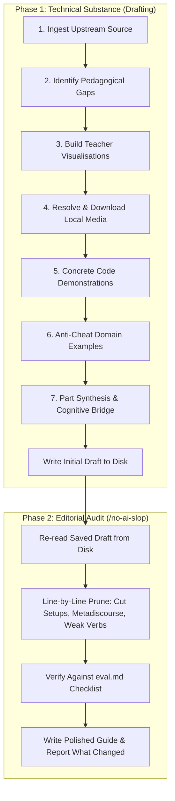

# MOOC Conceptual Guide Review and Editing

A workflow to audit, enrich, and refine Helsinki Java MOOC conceptual guides (`<n>-<name>.md`). This skill focuses on reading guides, mental models, diagrams, and direct technical prose, separate from exercise generation.

---

## Pipeline Overview

Drafting and editing must never occur in a single generation step. Doing both simultaneously causes generation bias, leaving behind throat-clearing setups, narrative filler, and wordy headings. The workflow enforces an explicit two-phase boundary:

---

## Phase 1: Technical Substance (Drafting)

### Step 1: Upstream Ingestion and Comparison
1. Compare the local `<n>-<name>.md` guide with the official Helsinki MOOC repository (`rage/java-programming/master/data/part-X/Y-name.md`) and online platform (`https://java-programming.mooc.fi/`).
2. Identify missing explanations, historical context, practical analogies, and domain discussions.

### Step 2: Pedagogical Gap Analysis
Audit the draft for clarity and technical depth:
- Explain why a mechanism exists rather than only its syntax.
- Model real-world systems (such as banking transfers, flight bookings, or statutory tax rules).
- Address edge cases and failure modes (such as priority task scheduling, negative parameter behavior, or input parsing crashes).

### Step 3: Teacher Visualisations (Mermaid Diagrams)
Make invisible mechanics visible with Mermaid diagrams:
- Use `graph LR` or sequence diagrams for multi-service workflows (such as flight booking validation cascades or input-process-output pipelines).
- Use `graph TD` for decision trees and priority schedulers (such as Margaret Hamilton's Apollo 11 scheduler or multi-way condition cascades).
- Diagram stack and heap memory layouts for primitive values versus object references.

### Step 4: Asset Resolution and Local Download
Download all referenced diagrams, illustrations, and photos into the section folder:
- Fetch images from the upstream MOOC repository or public archives with `curl`.
- Use relative local paths (such as `./margeret-action.jpg`). Never leave external hotlinks in the guide.

### Step 5: Concrete Code Demonstrations
Show subtle language behaviors with executable Java snippets:
- Write real code for riddles and thought experiments (such as the milk and oranges riddle).
- Demonstrate variable assignments, scoping rules, and type widening directly.

### Step 6: Anti-Cheat Domain Examples
Audit every code snippet in the conceptual guide:
- Code examples in the guide must never solve upcoming exercises.
- If an exercise checks speed limits, write guide examples using freezer temperatures, altitude thresholds, or battery percentages.

### Step 7: Part Synthesis and Cognitive Bridge
- Add a reference table that maps each language construct to its runtime role.
- State the mechanical limits of the current code to motivate the next module (for example, how sequential code cannot repeat without loops).
- Write this complete initial draft to disk.

---

## Phase 2: Mandatory Editorial Audit (`/no-ai-slop`)

**Do not skip this phase or merge it into Phase 1.** Re-read the file written in Phase 1 and apply a dedicated editing pass as defined in `/no-ai-slop`.

### Line-by-Line Pruning Criteria
1. **Cut throat-clearing setups and atmospheric openers:**
   - Remove generic essay intros ("Programming tasks that appear distinct on the surface rely on...").
   - Lead directly with technical assertions ("Most programs break down into four recurring sub-problems:").
   - Drop situational throat-clearing ("Real-world operations depend on conditions: equipment shuts down if...").
2. **Delete interpretive metadiscourse:**
   - Cut text that merely restates what a Mermaid diagram or table already shows ("State flows in one direction: incoming values populate variables...").
   - Cut authorial guiding commentary ("Tracing variables across distinct inputs demonstrates how state evolves...").
3. **Tighten headings:**
   - Replace wordy academic headings with concise technical labels (e.g., `Sub-Problems and the Dataflow Pipeline` instead of `The Sub-Problem Mental Model & The Dataflow Pipeline`).
4. **Enforce active voice and direct verbs:**
   - Replace weak verb phrases ("requires two elements: importing X and wrapping Y" $\rightarrow$ "requires importing X and wrapping Y").
5. **Purge banned vocabulary and empty qualifiers:**
   - Zero tolerance for: *delve*, *foster*, *leverage*, *utilize*, *streamline*, *robust*, *crucial*, *paramount*, *tapestry*, *testament*, *supercharge*.
   - Cut empty adverbs: *literally*, *actually*, *simply*, *fundamentally*, *purely*.
   - Em dashes: 0 in body copy, maximum 1-2 across entire document if strictly necessary.
6. **Verify against `eval.md`:**
   - Check the draft directly against the checks in `~/.gemini/config/skills/no-ai-slop/eval.md`.
7. **Write the final edited guide and report changes:**
   - Overwrite the file with the tightened text and provide a concise **What changed** summary.
