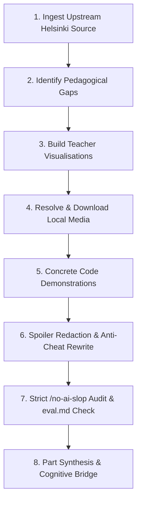

# MOOC Conceptual Guide Review and Editing

A workflow to audit, enrich, and refine Helsinki Java MOOC conceptual guides (`<n>-<name>.md`). This skill focuses on reading guides, mental models, diagrams, and direct technical prose, separate from exercise generation.

---

## Pipeline Overview

---

## Step-by-Step Execution

### Step 1: Upstream Ingestion and Comparison
1. Compare the local `<n>-<name>.md` guide with the official Helsinki MOOC repository (`rage/java-programming/master/data/part-X/Y-name.md`) and online platform (`https://java-programming.mooc.fi/`).
2. Identify missing explanations, historical context, practical analogies, and domain discussions.

### Step 2: Pedagogical Gap Analysis
Audit the draft for clarity and technical depth:
- Does the guide explain why a mechanism exists, rather than only its syntax?
- Are real-world systems modeled (such as banking transfers, flight bookings, or statutory tax rules)?
- Are failure modes and edge cases addressed (such as priority task scheduling and hardware interrupt overload)?

### Step 3: Teacher Visualisations (Mermaid Diagrams)
Make invisible mechanics visible with Mermaid diagrams:
- Use `graph LR` or sequence diagrams for multi-service workflows (such as flight booking validation cascades).
- Use `graph TD` for decision trees and priority schedulers (such as Margaret Hamilton's Apollo 11 scheduler).
- Diagram stack and heap memory layouts for primitive values versus object references.

### Step 4: Asset Resolution and Local Download
Download all referenced diagrams, illustrations, and photos into the section folder:
- Fetch images from the upstream MOOC repository or public archives with `curl`.
- Use relative local paths (such as `./margeret-action.jpg`). Never leave external hotlinks in the guide.

### Step 5: Concrete Code Demonstrations
Show subtle language behaviors with executable Java snippets:
- Write real code for riddles and thought experiments (such as the milk and oranges riddle).
- Demonstrate variable assignments, scoping rules, and integer division directly.

### Step 6: Anti-Cheat Example Rewriting
Audit every code snippet in the conceptual guide:
- Code examples in the guide must never solve upcoming exercises.
- If an exercise checks speed limits, write guide examples using freezer temperatures, altitude thresholds, or battery percentages.

### Step 7: Strict `/no-ai-slop` Audit
Run the `/no-ai-slop` skill against the draft and verify against `eval.md`:
- Purge banned words: *delve*, *foster*, *leverage*, *utilize*, *streamline*, *robust*, *crucial*, *paramount*, *tapestry*, *testament*, *supercharge*.
- Cut empty adverbs: *literally*, *actually*, *simply*, *fundamentally*, *purely*.
- Convert binary contrasts and negative listings ("Not X, but Y") into direct assertions of Y.
- Replace trailing `-ing` clauses with active sentences.
- Remove em dash clusters, decorative bolding, and emoji headers.
- Delete fake-profound kickers and summary recaps. End on concrete takeaways or next actions.

### Step 8: Part Synthesis and Cognitive Bridge
- Add a reference table that maps each language construct to its runtime role.
- State the mechanical limits of the current code to motivate the next module (for example, how sequential code cannot repeat without loops).
