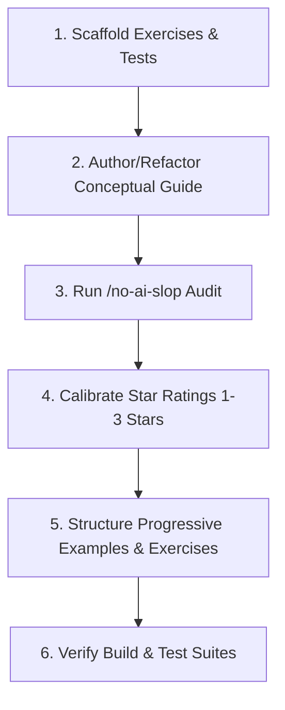

# MOOC Section Scaffolding & Conceptual Markdown Refactor

Workflow for preparing a Helsinki MOOC section: extract exercises into files, generate JUnit 5 test suites, assign difficulty ratings, write progressive conceptual guides, and strip AI filler.

---

## Pipeline

Follow these steps in order:



---

## Steps

### 1. Scaffold Individual Exercises

Every section isolates its exercises into a dedicated `exercises/` subfolder, keeping conceptual guides at the root of the section directory:

```text
partXX/sYY<name>/
├── <n>-<name>.md               <-- Conceptual guide
└── exercises/                  <-- Package: partXX.sYY<name>.exercises
    ├── <ExerciseName>.java
    └── <ExerciseName>.md
```

For applied logic and problem-solving modules (such as Section 1.6.5):
```text
partXX/sYY<name>/
├── <n>-<name>.md
├── exercises/                  <-- Standard MOOC exercises
└── logic/
    ├── <n.5>-applied-logic.md  <-- Applied logic guide
    └── exercises/              <-- Package: partXX.sYY<name>.logic.exercises
        ├── <ExerciseName>.java
        └── <ExerciseName>.md
```

#### A. Create the Exercise Specification (`<ExerciseName>.md`)
Location: `src/main/java/partXX/sYY<name>/exercises/<ExerciseName>.md` (or `.../logic/exercises/...`)

Include:
- Top-right difficulty badge:
  ```html
  <div align="right">
    <b>Difficulty:</b> ✪✪ (2/7)
  </div>
  ```
- Exercise metadata (`**Exercise:**`, `**Category:**`, `**Difficulty:**`, `**Package:**`)
- **Spec:** Bullet points with exact terminal prompts and calculation requirements.
- **Examples:** Markdown table with stdin vs expected stdout.
- **Terminal Practice:** Exact Gradle test command:
  ```bash
  ./gradlew test --tests "partXX.sYY<name>.exercises.<ExerciseName>Test"
  ```

#### B. Create the Java Starter File (`<ExerciseName>.java`)
Location: `src/main/java/partXX/sYY<name>/exercises/<ExerciseName>.java`
```java
package partXX.sYY<name>.exercises;

import java.util.Scanner;

public class ExerciseName {
    public static void main(String[] args) {
        Scanner scanner = new Scanner(System.in);

        // Write your program here

    }
}
```

#### C. Create the JUnit 5 Test Class (`<ExerciseName>Test.java`)
Location: `src/test/java/partXX/sYY<name>/exercises/<ExerciseName>Test.java`
- Package declaration matches: `package partXX.sYY<name>.exercises;`.
- Redirect `System.in` and `System.out` in `@BeforeEach` and restore them in `@AfterEach`.
- Add at least 3 test cases covering standard inputs, boundary values, and edge cases.
- Assert against prompts and computed outputs with descriptive failure messages.

---

### 2. Audit Markdown Against AI Patterns (`/no-ai-slop`)

Audit every markdown file (specs and guides) before publishing:

- **Cut banned words:** `delve`, `foster`, `leverage`, `utilize`, `streamline`, `robust`, `crucial`, `paramount`, `dive in`, `tapestry`, `testament`.
- **Drop dramatic labels:** Replace melodrama like "The Trap", "The Instinctive Trap", and "Literal Negation" with technical descriptions (`Wrap with !`, `Keep && (Broken)`, `Single Guard Clause`).
- **Remove obscure academic jargon:** Avoid abstract terms like "parity testing", "multi-branch classification", "1D interval collision detection", and formal logic symbols ($\\neg, \\land, \\lor$). Name the exact programming behavior in plain terms: "checking even or odd with remainder operator (`% 2 == 0`)", "checking if two number ranges overlap", and boolean operators (`!`, `&&`, `||`).
- **Explain KEY terminology:** Ground every key term right where it is introduced using Helsinki MOOC mental models (containers for variables, memory addresses vs character values for strings).
- **Include modern Java advice:** Add practical `> [!TIP]` callouts for modern Java features (Java 11 single-file launch, Java 15 text blocks, Java 10 `var`, Java 14 switch expressions) while explaining why fundamentals come first.
- **Cut throat-clearing and binary contrasts:** Drop generic setup phrases. State the point directly in active voice with concrete code.

---

### 3. Calibrate Star Ratings (1–7 Scale, Capped at 3 Stars)

Calibrate exercises between 1 and 3 stars on a universal 7-star scale (where 6–7 stars represent complex algorithmic challenges):

| Rating | Tier Name | Criteria & Cognitive Demands | Examples |
| :--- | :--- | :--- | :--- |
| **✪ (1/7)** | **Basic Mechanics** | Single sequential flow; no branching or single trivial `if`; direct string literals or single print/read operations. | `AdaLovelace`, `Greeting`, `Positivity`, `Password` |
| **✪✪ (2/7)** | **Elementary Branching & Types** | 2-boundary range checks (`[min, max]`), multi-branch `if-else if-else`, type conversion/casting in division, remainder check (`% 2 == 0`). | `OddOrEven`, `ValidScore`, `TemperatureAlert`, `WorkingHours` |
| **✪✪✪ (3/7)** | **Multi-Variable & Compound Logic** | Compound logic with 3+ variables, interval overlap, stepped rate calculations, 24-hr clock math, leap-year rules. | `ValidTriangle`, `LeapYear`, `GiftTax`, `MiddleOfThree`, `RangeOverlap` |

**Rules:**
- Every exercise file must include both the top-right HTML badge `<div align="right"><b>Difficulty:</b> ✪...</div>` and the metadata line `**Difficulty:** ✪...`.
- Match the star count to the rubric above. Do not assign more than 3 stars in this introductory course.

---

## 4. Structure Conceptual Guides (`<n>-<name>.md`)

Place exercises directly below the concept they practice, then group extra applied exercises at the end.

### A. Three Progressive Worked Examples Per Topic
For each core concept, provide 3 progressive examples:
1. **Example 1 (Basic / ✪):** Single-concept demonstration -> follow immediately with **Practice (✪ 1/7)** linking one-star exercises.
2. **Example 2 (Medium / ✪✪):** Two-boundary range check or linear classification -> follow immediately with **Practice (✪✪ 2/7)** linking two-star exercises.
3. **Example 3 (Harder / ✪✪✪):** Compound constraint, tiered rate, range overlap, or cycle -> follow immediately with **Practice (✪✪✪ 3/7)** linking three-star exercises.

### B. Common Pitfalls
Explain specific code errors after the examples (out-of-order branches, flipped logic operators, flat-rate calculation traps, integer division truncation).

### C. Official Documentation
Link to official Oracle Java Tutorials and Javadoc at the bottom.

---

### 5. Verification & Git Autonomy

- Run `./gradlew compileJava compileTestJava` to confirm starters and tests compile.
- Run tests with `./gradlew test --tests ...`.
- Never run `git commit` or `git push`. Let the user stage and commit their own code.
