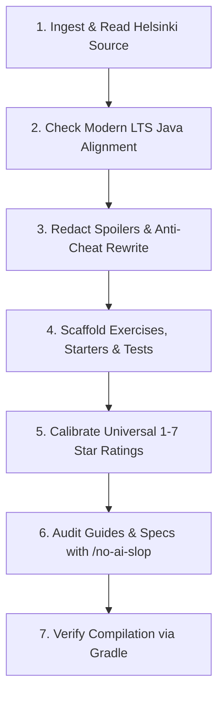

# MOOC Section Scaffolding & Conceptual Guide Ingestion

A standardized pipeline to ingest a Helsinki Java MOOC section from the official curriculum (https://java-programming.mooc.fi/), refactor it into clean, spoiler-free conceptual guides, scaffold isolated exercises with JUnit 5 test suites, and calibrate difficulty ratings on a 1–7 star scale.

---

## Complete Scaffolding Pipeline



---

## Step-by-Step Execution

### Step 1: Ingest Helsinki Course Material
1. Locate or fetch the target section from Helsinki MOOC:
   - Base URL: `https://java-programming.mooc.fi/part-<X>/<Y>-<section-name>`
   - Alternatively read existing raw markdown if already present in `src/main/java/partXX/sYY<name>/<n>-<name>.md`.
2. Extract:
   - Core learning objectives.
   - Conceptual themes, explanations, and diagrams.
   - Programming exercise requirements, sample inputs, and expected console outputs.

---

### Step 2: Modernize Java Advice (LTS Standards)
- Ensure all explanations, syntax, and conventions align with modern LTS Java (Java 17 / 21) while respecting pedagogical progression:
  - Mention modern enhancements in `> [!TIP]` callouts (e.g. text blocks, `var`, switch expressions, enhanced pattern matching).
  - Explicitly explain why introductory sections teach core syntax first before syntactic sugar.
  - Never leap ahead of the learner's scope (e.g. avoid streams, lambdas, or complex OOP in Part 1).

---

### Step 3: Redact Spoilers & Anti-Cheat Example Rewriting (CRITICAL)
In the raw MOOC text, code examples frequently give away the exact solution to the exercises that follow immediately.
- **Rule:** The conceptual guide must **NEVER** contain a code example that directly solves a section exercise.
- **Action:** Audit every code snippet in the conceptual guide:
  - If an exercise asks to check if a speed exceeds 120 (`SpeedingTicket`), rewrite the guide's example to use a completely different domain (e.g. checking freezer temperature, pressure thresholds, or battery percentage).
  - If an exercise asks to compute leap years, demonstrate nested/compound logic using employee shift scheduling or ticket discounts.
  - The conceptual guide must build the **mental model** and demonstrate the syntax, forcing the learner to independently apply the concept to the exercise domain.

---

### Step 4: Scaffold Isolated Exercises & JUnit 5 Tests

Every section must isolate its exercises in a dedicated `exercises/` subdirectory (or `logic/exercises/` for applied problem-solving modules):

```text
partXX/sYY<name>/
├── <n>-<name>.md               <-- Spoiler-free conceptual guide
└── exercises/                  <-- Package: partXX.sYY<name>.exercises
    ├── <ExerciseName>.java     <-- Clean starter file
    └── <ExerciseName>.md       <-- Detailed specification
```

#### A. Exercise Specification (`<ExerciseName>.md`)
Location: `src/main/java/partXX/sYY<name>/exercises/<ExerciseName>.md`
Must include:
- Top-right difficulty badge:
  ```html
  <div align="right">
    <b>Difficulty:</b> ✪✪ (2/7)
  </div>
  ```
- Metadata headers: `**Exercise:**`, `**Category:**`, `**Difficulty:**`, `**Package:**`.
- **Spec:** Bulleted requirements, exact console prompts, calculation rules.
- **Examples:** Clean Markdown table displaying stdin vs expected stdout.
- **Terminal Practice:** Exact Gradle test command:
  ```bash
  ./gradlew test --tests "partXX.sYY<name>.exercises.<ExerciseName>Test"
  ```

#### B. Java Starter File (`<ExerciseName>.java`)
Location: `src/main/java/partXX/sYY<name>/exercises/<ExerciseName>.java`
```java
package partXX.sYY<name>.exercises;

import java.util.Scanner;

public class ExerciseName {
    public static void main(String[] args) {
        Scanner scanner = new Scanner(System.in);

        // Write your program here

    }
}
```

#### C. JUnit 5 Test Class (`<ExerciseName>Test.java`)
Location: `src/test/java/partXX/sYY<name>/exercises/<ExerciseName>Test.java`
- Package matches: `package partXX.sYY<name>.exercises;`.
- Use `@BeforeEach` and `@AfterEach` to redirect and restore `System.in` and `System.out`.
- Include at least 3 distinct test cases covering:
  1. Standard/happy path input.
  2. Boundary/threshold values (e.g. exact threshold boundary).
  3. Edge/rejection cases (zero, negative, or invalid states).

---

### Step 5: Calibrate Star Ratings (Universal 1–7 Scale)

Calibrate every exercise and drill against the universal 7-star difficulty rubric:

| Rating | Tier Name | Criteria & Cognitive Demands | Scope & Course Capping |
| :--- | :--- | :--- | :--- |
| **✪ (1/7)** | **Basic Mechanics** | Sequential flow; single print/read; trivial single `if`; direct string literal matches. | Standard MOOC Parts 1–2 |
| **✪✪ (2/7)** | **Elementary Branching & Types** | 2-boundary range checks (`[min, max]`), `if-else if-else`, type casting, remainder (`% 2 == 0`). | Standard MOOC Parts 1–3 |
| **✪✪✪ (3/7)** | **Multi-Variable & Compound Logic** | Compound logic (3+ variables), interval overlap, stepped/tiered pricing, 24-hr clock wrap. | Standard MOOC Parts 1–4 |
| **✪✪✪✪ (4/7)** | **State Tracking & Object Graphs** | Complex nested loops, object state encapsulation, multi-step validation. | **Course Cap** (Parts 4–14) |
| **✪✪✪✪✪ to ✪✪✪✪✪✪✪ (5–7/7)** | **Algorithmic & Competitive Drills** | Dynamic programming, recursion depth, graph traversals, custom data structures. | **Drills Only** (Extension challenges) |

> [!NOTE]
> Standard curriculum exercises are capped at **3 to 4 stars**. Ratings of 5 to 7 stars are reserved strictly for extension drill challenges.

---

### Step 6: Audit Against AI Slop (`/no-ai-slop`)
Audit **both** the conceptual markdown guide (`<n>-<name>.md`) and every exercise specification (`<ExerciseName>.md`):
- **Purge banned vocabulary:** `delve`, `foster`, `leverage`, `utilize`, `streamline`, `robust`, `crucial`, `paramount`, `dive in`, `tapestry`, `testament`.
- **Remove dramatic labels:** Replace melodrama like *"The Lethal Trap"* with precise technical names (`Flipped Operator`, `Single Guard Clause`).
- **Ground key terminology:** Define each concept immediately with clear mental models.
- **Direct, active voice:** Cut throat-clearing intros ("In this section, we will explore..."). Lead with the code and concept.

---

### Step 7: Verify Compilation
Run Gradle compilation to verify all newly generated starters and test classes compile cleanly:
```bash
./gradlew compileJava compileTestJava
```
*Never execute git commits or pushes. Leave git operations to the learner.*
