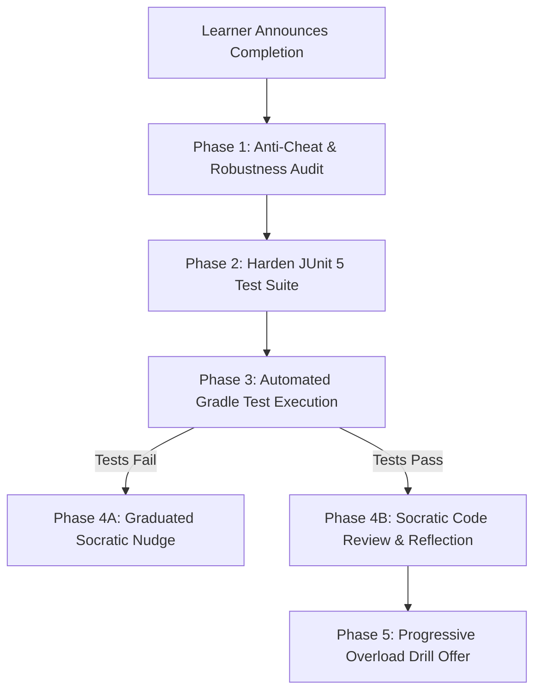

# MOOC Exercise Verification & Test Hardening Pipeline

When the learner announces completion of an exercise (e.g. *"Look, I finished this"*, *"I finished ValidTriangle"*, or `/mooc-verify`), activate this skill to inspect the implementation, harden the JUnit 5 test suite against cheat/hack solutions, run automated verification, and conduct a Socratic review.

---

## Verification Pipeline



---

## Step-by-Step Execution

### Phase 1: Anti-Cheat & Robustness Audit
Inspect the learner's implementation in `<ExerciseName>.java` alongside the existing test suite in `<ExerciseName>Test.java`.

Analyze the test suite for **vulnerabilities and cheat bypasses**:
1. **Hardcoded Outputs:** Could a program that merely prints the exact strings from the problem description pass the tests without performing actual calculations?
2. **Missing Boundary Tests:** 
   - Strict inequalities (`>` vs `>=`): If the requirement is `speed > 120`, does the test verify behavior at exactly `120` and `121`?
   - Range boundaries: Are both inclusive edges tested (`min`, `max`, `min - 1`, `max + 1`)?
3. **Missing Equivalence Partitions:**
   - Numbers: Zero (`0`), negative values, large positive values.
   - Strings: Empty string `""`, casing variations, whitespace, multi-word strings.
   - Parity / Divisibility: Odd numbers, even numbers, numbers divisible by neither, numbers divisible by both.
4. **Order Dependence:** Does the test suite verify that inputs in different orders (e.g. `MiddleOfThree`) produce the correct result regardless of permutation?

---

### Phase 2: Harden the JUnit 5 Test Suite
If the test suite is insufficient to prevent cheat answers or missing critical boundary conditions:
1. Edit `<ExerciseName>Test.java` to add the missing test cases.
2. Ensure assertions test **both** the specific calculation and boundary conditions.
3. Keep test method names self-descriptive (e.g. `testExactThresholdBoundaryDoesNotTriggerTicket()`, `testNegativeZeroAndLargeValues()`).
4. Keep the package and stream redirection structure consistent (`setUpStreams()`, `restoreStreams()`).

---

### Phase 3: Automated Gradle Test Execution
Run the specific test suite directly:
```bash
./gradlew test --tests "<full.package.name>.<ExerciseName>Test"
```

Inspect the test results:
- If tests compile and pass: proceed to **Phase 4B**.
- If tests fail: proceed to **Phase 4A**.

---

### Phase 4A: Failure Handling (Socratic Nudge)
> [!CAUTION]
> **NEVER provide code fixes or rewrite the student's solution.**

1. Identify which specific test case or assertion failed.
2. Offer a Tier 1 or Tier 2 graduated nudge:
   - State the failing input: *"When input is `X`, the expected output is `Y`, but your program output `Z`."*
   - Ask a guiding question: *"What does your first conditional branch evaluate to when the number is exactly `0`?"*
   - Direct the learner to run the test locally via their terminal and observe the failure trace.

---

### Phase 4B: Success Handling (Socratic Code Review & Reflection)
When all hardened tests pass:
1. **Praise Effort:** Acknowledge clean logic and successful test execution.
2. **Socratic Code Review:**
   - Comment on code readability, variable naming clarity, and idiomatic Java within the scope of the current section.
   - If logic can be simplified (e.g. redundant `else if` conditions that are already guaranteed by prior branches, or applying De Morgan's laws), point it out as a conceptual observation.
3. **Reflection Question:** Pose one conceptual question to deepen understanding:
   - *"What would happen to your branch ordering if requirement W were introduced?"*
   - *"Could this logic be inverted using guard clauses?"*

---

### Phase 5: Progressive Overload (Drill Challenge)
After confirming mastery:
- Ask if the learner wants to tackle an optional custom **drill challenge** of increased difficulty (e.g., bumping from ✪✪ to ✪✪✪) before moving to the next section or exercise.
