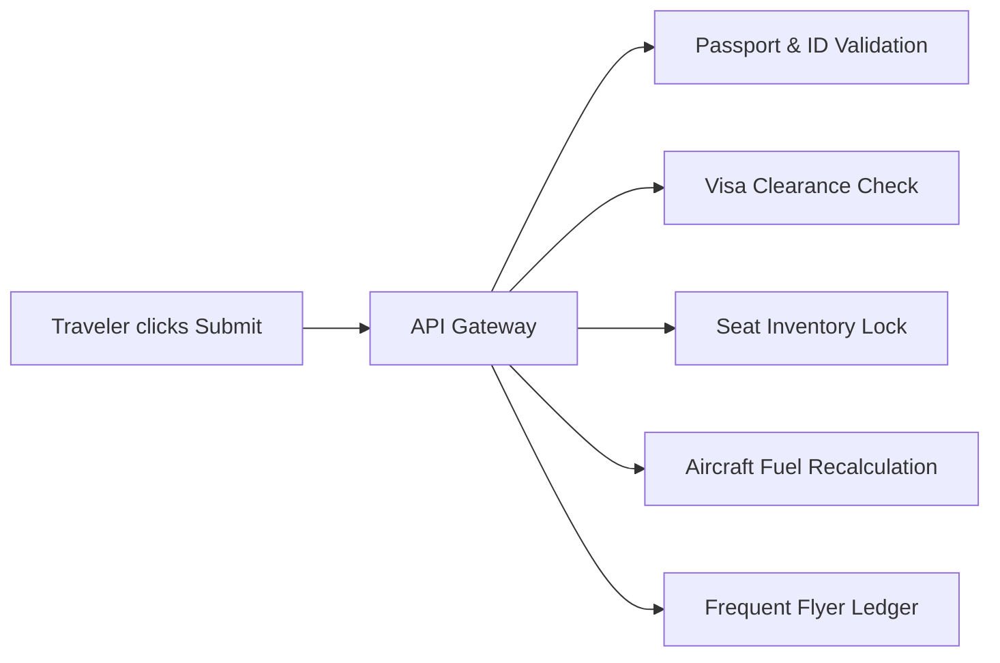
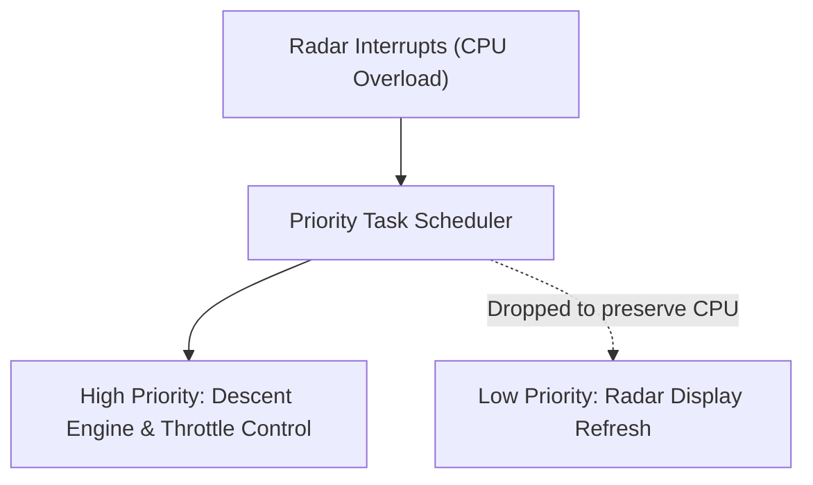

Modern infrastructure runs on software. Everyday transactions (banking transfers, retail checkouts, transit ticketing, medical records, and flight bookings) depend on codebases running without manual intervention.

When a traveler books a flight online, submitting a form initiates communication across independent services:



Each service enforces concrete domain rules. The seat inventory service verifies seat availability. The visa system checks border requirements. The fuel calculation service computes fuel load based on passenger count and distance.

Software engineers design and maintain these rules. Building software requires understanding both language syntax and domain laws. In Section 1.6, the `GiftTax` exercise required calculating statutory rates from Finnish tax law. In production, commercial tax engines execute that exact logic across millions of financial transactions.

## Silent Infrastructure and Fault Tolerance

Software often remains invisible until it fails.

In 1969, [Margaret Hamilton](https://en.wikipedia.org/wiki/Margaret_Hamilton_(scientist)) directed the Software Engineering Division at the MIT Instrumentation Laboratory, which developed the on-board flight software for the Apollo project.


During the Apollo 11 lunar descent, a radar switch was set in the wrong position. The switch flooded the Apollo Guidance Computer (AGC) with unexpected interrupts. These interrupts consumed 15% of the computer's CPU cycles three minutes before touchdown.

Hamilton's team designed the flight software using an asynchronous executive scheduler. The scheduler evaluated task priorities:



The system dropped low-priority radar displays and preserved the throttle and navigation computations. The lunar module landed safely because the software handled overload through explicit priority logic.

## Literal Execution: Intent Versus Code

Computers execute instructions literally. Humans rely on context to resolve ambiguity, but a computer executes only the operations written in the code.

The Helsinki course illustrates this gap with a classic shopping riddle:

> "Buy two cartons of milk. If the store has oranges, buy four."

A human shopper buys two cartons of milk and four oranges. A program running that instruction without an explicit second variable produces a different result:

```java
int milkCount = 2;
boolean hasOranges = true;

if (hasOranges) {
    milkCount = 4;
}

System.out.println("Cartons of milk: " + milkCount);
```

```text
Cartons of milk: 4
```

The program assigned 4 to `milkCount` because the condition modified the existing milk variable instead of creating an orange variable. Most software defects stem from incomplete domain rules rather than syntax errors.

## Part 1 Summary

Over Part 1, you used six core building blocks:

| Concept | Language Construct | Purpose |
| :--- | :--- | :--- |
| **Entry Point** | `public static void main(String[] args)` | Defines where the Java Virtual Machine starts execution. |
| **Console I/O** | `System.out.println()`, `Scanner` | Prints text to the console and reads typed input. |
| **State Storage** | `int`, `double`, `boolean`, `String` | Allocates memory for integers, decimals, truth values, and text. |
| **Arithmetic** | `+`, `-`, `*`, `/`, `%` | Computes values using operator precedence and integer division rules. |
| **Branching** | `if`, `else if`, `else` | Directs execution flow based on boolean expressions. |
| **Compound Conditions** | `&&`, `\|\|`, `!` | Joins multiple conditions with short-circuit boolean evaluation. |

## Transition to Part 2

Every program written in Part 1 ran sequentially from top to bottom and terminated.

Real software must solve two limitations of sequential code:
1. **Repetition:** Running an operation multiple times without duplicating statements.
2. **Decomposition:** Splitting large programs into isolated, reusable methods.

In Part 2, you will use `while` loops to repeat logic and write custom methods to organize programs into modular units.
