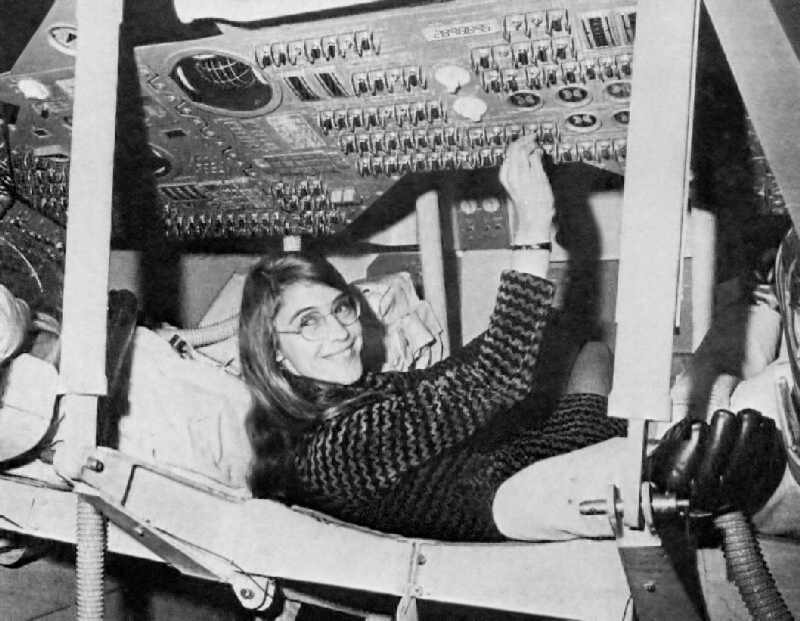

When you're just starting to learn programming, it's hard to realize how dependent our society actually is on the software produced by developers. Without software, everyday things such as communication, shopping, travel, and so on would all be more complicated. Mobile phones could not work -- or there would be very few of them, and we'd have no credit cards, let alone online banking. Travel reservations and the use of personal documents online would be impossible. Electronic health services such as e-prescriptions and the seamless transfer of patient data between wards and hospitals would be the stuff of dreams. There'd also be no Wikipedia or search engines, so any time you'd like to know something, you'd open a dictionary or an encyclopedia.

As services become based on software, their inherent complexity becomes hidden from us. For instance, when you travel by air and check-in using an online form, the sending of the form sets off a series of communication between dozens of different systems. Information about your name, personal information, state of your passport, any possible visas, the state of your flight, and your previous flights are all checked. Your seat reservations pass through a seat-reservation management system, and your airline customer-loyalty status is reviewed. The amount of fuel the airplane needs to for refueling will also need to be updated, and the list goes on. All of this happens as a result of you clicking the send button on the online form.

Software professionals are the architects of these kinds of digital services. It's the responsibility of those of us who study computer science and engineering to implement these systems in a way that ensures that they function as well as they can for their intended users -- and also for those not familiar with similar systems. At the same time, architects of digital services learn a lot about different business domains and the practicalities of everyday life. For instance, you already know more about gift taxation (the last part of the previous section) than most Finns do - someone has also implemented a gift-tax calculator for the tax service.

The end-users of a given system are seldom aware of those who produced it. For example, few have heard of [Margaret Hamilton](<https://en.wikipedia.org/wiki/Margaret_Hamilton_(scientist)>) who, with her team, wrote the program that took man to the moon.

Programming can be considered the artisanship of our time, and the ever-increasing demand for understanding software and digital systems is evident everywhere. Fundamentals of programming are already taught in elementary school; and various fields, including modern science, make use of software and its latest innovations in data analysis. Meteorologists, physicists and chemists also use software and many write code at work. Pedagogy and teacher training are also increasingly benefitting from the possibilities created by digitalization. It's now more difficult to list professions that are not impacted by software and digitalization than those that are.

You've now taken your first steps in the world of programming. During the course you will learn to write programs and understand how they work - you will categorize a program's sub-entities into small parts, and present the concepts that appear in the program as pieces working together in harmony. After the course, you may also begin to think about public services from a programmer's perspective and consider their functioning (or lack of it) in terms of the opportunities and limitations of software.

After this course, simple instructions, such as "_Buy two cartons of milk. If the shop has oranges, buy four of them._", will be viewed in a different way. Although this message may be clear to a human, a computer might end up buying four cartons of milk.

Great to have you on this journey!

Please, take a moment to answer a self-reflective survey on the learning goals of the first part.

