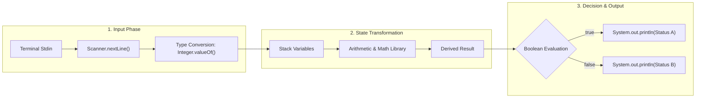
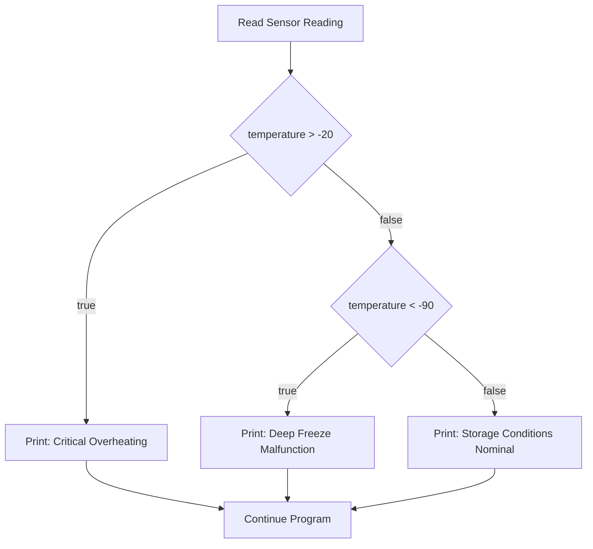

> [!NOTE]
> **Learning Objectives**
>
> - Break programming tasks down into standard, recurring sub-problems.
> - Structure programs using the canonical Input-Process-Output dataflow pipeline.
> - Control terminal cursor placement using `System.out.print` versus `System.out.println`.
> - Perform calculations with functions from `java.lang.Math` such as `Math.sqrt()`.
> - Combine input reading, calculations, and multi-way conditional branching into composite solutions.

---

## 1. Sub-Problems and the Dataflow Pipeline

Most programs break down into four recurring sub-problems:

1. **Reading user input:** Prompt the user and parse text into typed variables.
2. **State transformation and calculation:** Apply arithmetic operators or library methods to produce new values.
3. **Decision and branching:** Evaluate boolean conditions to route execution down different paths.
4. **Output formatting:** Emit results to the terminal or downstream consumers.

Connecting these steps forms the Input-Process-Output (IPO) pipeline. Data enters from external sources, transforms through intermediate variables, and writes to an output stream.



---

## 2. Reading Input and Terminal Output Streams

Reading console input requires importing `java.util.Scanner` and wrapping `System.in`:

```java
import java.util.Scanner;

public class Program {
    public static void main(String[] args) {
        Scanner reader = new Scanner(System.in);

        String text = reader.nextLine();
        int count = Integer.valueOf(reader.nextLine());
        double measurement = Double.valueOf(reader.nextLine());
        boolean flag = Boolean.valueOf(reader.nextLine());
    }
}
```

### Type Conversion

The `Scanner.nextLine()` method reads an entire line of console input as a `String`. To perform numeric operations, pass that raw string to a type parser:

- `Integer.valueOf(reader.nextLine())` converts numeric text into a 32-bit integer (`int`).
- `Double.valueOf(reader.nextLine())` converts decimal text into a 64-bit floating-point number (`double`).
- `Boolean.valueOf(reader.nextLine())` converts the string `"true"` to `true`, and any other text to `false`.

### Terminal Output Streams: `print` vs. `println`

Java provides two primary methods on `System.out` to write text to the console:

| Method | Trailing Action | Cursor Position | Primary Use Case |
| :--- | :--- | :--- | :--- |
| `System.out.println(...)` | Appends a line break (`\n`) | Moves to the start of the next line | Distinct messages and completed records |
| `System.out.print(...)` | Omits a line break | Remains immediately after the last printed character | Inline input prompts |

When an interactive program asks the user for input, `System.out.print` keeps the cursor on the same line as the prompt:

```java
System.out.print("Enter sensor identifier: ");
String sensorId = reader.nextLine();
```

Terminal display:

```text
Enter sensor identifier: [Cursor waits here on prompt line]
```

Using `System.out.println` drops the cursor to the next line before reading:

```text
Enter sensor identifier:
[Cursor waits here on next line]
```

### Example 1: Interactive Sensor Telemetry Reader

Reading and parsing voltage and temperature readings from a hardware monitoring station:

```java
import java.util.Scanner;

public class TelemetryStation {
    public static void main(String[] args) {
        Scanner reader = new Scanner(System.in);

        System.out.print("Enter battery pack voltage (V): ");
        int voltage = Integer.valueOf(reader.nextLine());

        System.out.print("Enter operating temperature (C): ");
        int temperature = Integer.valueOf(reader.nextLine());

        System.out.println("Telemetry recorded: " + voltage + "V at " + temperature + "C");
    }
}
```

---

## 3. Calculations and State Transformation

Every calculation follows three steps:

1. **Define inputs:** Declare and populate the variables needed for the calculation.
2. **Execute operation:** Apply arithmetic operators or library methods and store the result in a variable.
3. **Dispatch result:** Print the calculated value, return it, or pass it to a condition.

### Variable Declaration and Initialization

You can separate variable declaration and assignment, or combine them into a single statement:

```java
// Two-step declaration and assignment
int baseLoad;
baseLoad = 400;

// Combined declaration and initialization (idiomatic)
int peakLoad = 400;
```

Declaring and initializing variables in one statement prevents reads of unassigned variables and keeps scope local to where the value is used.

### The `java.lang.Math` Library: `Math.sqrt()`

Java includes mathematical routines in `java.lang.Math`. Because the Java compiler automatically imports `java.lang` into every source file, you call these methods directly without an `import` statement.

To compute the square root of a number, use `Math.sqrt(double value)`:

```java
double root = Math.sqrt(49.0); // 7.0
```

Behavior and constraints:

1. **Parameter and return type:** `Math.sqrt` accepts a `double` and returns a `double`. Passing an `int` automatically widens the value to a `double`:
   ```java
   int area = 64;
   double side = Math.sqrt(area); // area widens from 64 to 64.0, side is 8.0
   ```
2. **Negative inputs:** In real arithmetic, the square root of a negative number is undefined. Passing a negative number to `Math.sqrt` does not throw an exception. It returns `Double.NaN` ("Not a Number"):
   ```java
   double invalid = Math.sqrt(-25.0);
   System.out.println(invalid); // prints: NaN
   ```

### Example 2: Euclidean AGV Displacement

Calculating straight-line Autonomous Guided Vehicle (AGV) displacement across a warehouse floor using the Pythagorean theorem ($d = \sqrt{\Delta x^2 + \Delta y^2}$):

```java
import java.util.Scanner;

public class AgvDisplacement {
    public static void main(String[] args) {
        Scanner reader = new Scanner(System.in);

        System.out.print("Enter horizontal displacement (m): ");
        int deltaX = Integer.valueOf(reader.nextLine());

        System.out.print("Enter vertical displacement (m): ");
        int deltaY = Integer.valueOf(reader.nextLine());

        // Step 1: Calculate sum of squares
        int sumOfSquares = (deltaX * deltaX) + (deltaY * deltaY);

        // Step 2: Calculate square root
        double straightLineDistance = Math.sqrt(sumOfSquares);

        // Step 3: Dispatch result
        System.out.println("Direct displacement: " + straightLineDistance + " meters");
    }
}
```

#### Practice

- **✪ (1/7)** [Squared.md](./Squared.md) / [Squared.java](./Squared.java) — integer squaring via self-multiplication ($x \times x$)
- **✪✪ (2/7)** [SquareRootOfSum.md](./SquareRootOfSum.md) / [SquareRootOfSum.java](./SquareRootOfSum.java) — two-variable summation and square root calculation via `Math.sqrt()`

---

## 4. Conditional Logic and Multi-Way Branching

Conditional execution routes program flow through `if`, `else if`, and `else` blocks:

```java
if (condition1) {
    // Executes when condition1 is true
} else if (condition2) {
    // Executes when condition1 is false and condition2 is true
} else {
    // Executes when all preceding conditions are false
}
```

### Execution Invariants

1. **Mutual exclusivity:** In an `if-else if-else` chain, at most one branch executes.
2. **Top-to-bottom evaluation:** Java tests conditions in the exact order written. Once a condition evaluates to `true`, Java runs that block and skips the rest of the chain.
3. **The catch-all `else`:** An `else` block runs only when every preceding condition evaluates to `false`.



### Example 3: Cryogenic Vaccine Storage Monitor

Classifying freezer storage state for biological materials kept between $-90^\circ\text{C}$ and $-20^\circ\text{C}$:

```java
int currentTemp = -15;

if (currentTemp > -20) {
    System.out.println("Alert: Critical overheating. Relocate contents.");
} else if (currentTemp < -90) {
    System.out.println("Alert: Deep freeze sensor malfunction.");
} else {
    System.out.println("Status: Storage conditions nominal.");
}
```

#### Practice

- **✪✪ (2/7)** [AbsoluteValue.md](./AbsoluteValue.md) / [AbsoluteValue.java](./AbsoluteValue.java) — sign inversion conditional branch ($x < 0$)
- **✪✪ (2/7)** [ComparingNumbers.md](./ComparingNumbers.md) / [ComparingNumbers.java](./ComparingNumbers.java) — three-way numeric comparison (`>`, `<`, `==`)

---

## 5. Combining Patterns into a Pipeline

Real programs combine input reading, calculation, and conditional branching into a single workflow.

### Example 4: Air Freight Volumetric Billing Engine

Air cargo carriers bill based on physical weight or volumetric space, whichever is higher:

1. **Input:** Read package dimensions (`length`, `width`, `height` in centimeters) and scale weight (`scaleWeight` in kilograms).
2. **Calculation:** Compute volumetric weight using the standard International Air Transport Association (IATA) divisor of $5000$:
   $$\text{Volumetric Weight} = \frac{\text{Length} \times \text{Width} \times \text{Height}}{5000}$$
3. **Branching:** Select the higher weight as `billableWeight`, then assign the rate category.

```java
import java.util.Scanner;

public class AirFreightBilling {
    public static void main(String[] args) {
        Scanner reader = new Scanner(System.in);

        // Stage 1: Input reading
        System.out.print("Enter package length (cm): ");
        int length = Integer.valueOf(reader.nextLine());

        System.out.print("Enter package width (cm): ");
        int width = Integer.valueOf(reader.nextLine());

        System.out.print("Enter package height (cm): ");
        int height = Integer.valueOf(reader.nextLine());

        System.out.print("Enter scale weight (kg): ");
        double scaleWeight = Double.valueOf(reader.nextLine());

        // Stage 2: State transformation and calculation
        int volumeCm3 = length * width * height;
        double volumetricWeight = (double) volumeCm3 / 5000.0;

        // Determine billable weight
        double billableWeight = scaleWeight;
        if (volumetricWeight > scaleWeight) {
            billableWeight = volumetricWeight;
        }

        System.out.println("Volume: " + volumeCm3 + " cm3");
        System.out.println("Volumetric weight: " + volumetricWeight + " kg");
        System.out.println("Billable weight: " + billableWeight + " kg");

        // Stage 3: Multi-way conditional classification
        if (billableWeight > 50.0) {
            System.out.println("Category: Heavy Freight (Forklift required)");
        } else if (billableWeight >= 5.0) {
            System.out.println("Category: Standard Commercial Parcel");
        } else {
            System.out.println("Category: Small Express Packet");
        }
    }
}
```

### Trace Table: Air Freight Billing

| Variable / Stage | Case 1: Dense Cargo (Lead weight) | Case 2: Bulky Cargo (Pillow box) | Case 3: Small Envelope |
| :--- | :--- | :--- | :--- |
| `length`, `width`, `height` | $30 \times 20 \times 10$ | $80 \times 60 \times 50$ | $20 \times 15 \times 2$ |
| `scaleWeight` | $60.0$ kg | $12.0$ kg | $0.4$ kg |
| `volumeCm3` | $6{,}000\text{ cm}^3$ | $240{,}000\text{ cm}^3$ | $600\text{ cm}^3$ |
| `volumetricWeight` | $1.2$ kg | $48.0$ kg | $0.12$ kg |
| `billableWeight` | $60.0$ kg | $48.0$ kg | $0.4$ kg |
| Evaluated Branch | `billableWeight > 50.0` | `billableWeight >= 5.0` | `else` |
| Output Category | Heavy Freight | Standard Commercial Parcel | Small Express Packet |

---

## 6. Common Pitfalls

### 1. `NumberFormatException` on Empty or Non-Numeric Input
Calling `Integer.valueOf(reader.nextLine())` when the user presses Enter without typing a number, or enters non-digit characters, halts the program immediately:
```java
// User inputs: "forty"
int value = Integer.valueOf(reader.nextLine()); // Throws NumberFormatException
```
The parser accepts digit characters only, with an optional leading minus sign.

### 2. Silent `Double.NaN` Propagation
Taking the square root of a negative calculation does not produce a compiler error or runtime exception. It evaluates to `Double.NaN`, which propagates silently into subsequent arithmetic:
```java
int netScore = -16;
double root = Math.sqrt(netScore); // Evaluates to NaN
double total = root + 10.0;        // Evaluates to NaN
```
Verify that the radicand is non-negative before calling `Math.sqrt()`.

### 3. Missing Semicolons on Output Statements
Omitting the terminating semicolon on print statements halts compilation:
```java
System.out.println("Status recorded") // Syntax error: ';' expected
```

### 4. Shadowed Branches in Conditional Chains
Placing a broad condition before a narrow condition shadows the narrow condition, so the lower branch never runs:
```java
int weight = 75;

// Flawed ordering: weight > 10 matches every value over 10
if (weight > 10) {
    System.out.println("Standard");
} else if (weight > 50) {
    System.out.println("Heavy"); // Unreachable branch
}
```
Order conditions from most specific to least specific.

### 5. Block Scoping Traps
Variables declared inside conditional braces `{}` exist only within those braces:
```java
if (score > 100) {
    int bonus = 25;
} else {
    int bonus = 0;
}
System.out.println(bonus); // Compiler error: cannot find symbol 'bonus'
```
Declare the variable in the outer scope before the `if` statement when the value must persist after the branches finish.

---

## 7. Pattern Reference

| Sub-Problem Pattern | Java Implementation | Runtime Behavior | Invariant to Verify |
| :--- | :--- | :--- | :--- |
| **Input Reading** | `Scanner.nextLine()` with `Type.valueOf()` | Blocks execution until input stream receives newline | Input characters match target type |
| **Inline Prompting** | `System.out.print("Prompt: ")` | Writes to stdout without emitting a line break | Leaves cursor on the prompt line |
| **Arithmetic Transform** | `+`, `-`, `*`, `/`, `%` | Computes value in ALU registers and writes to variable | Integer division truncates towards zero; check divisors for zero |
| **Root Extraction** | `Math.sqrt(double a)` | Accepts `double`, computes square root, returns `double` | Input must be $\ge 0.0$ to avoid `Double.NaN` |
| **Two-Way Selection** | `if (cond) { ... } else { ... }` | Evaluates boolean expression and runs exactly one branch | Conditions are mutually exclusive |
| **Multi-Way Selection** | `if (...) else if (...) else` | Cascades top-to-bottom and exits at first `true` branch | Branches ordered from most specific to least specific |

---

## 8. The Limits of Linear Execution

Every program written so far executes sequentially from top to bottom, branches once, and terminates.

This linear model breaks down in two common scenarios:
- **Input validation retries:** When a user types `"abc"` instead of an integer, a linear program crashes or exits. The program cannot return to the input prompt without duplicating code.
- **Batch processing:** When processing 1,000 sensor readings or packages, a linear script requires pasting the entire reading and calculation block 1,000 times.

Duplicating code blocks creates brittle programs. Running instructions repeatedly until a termination condition is met requires **loops**.

In [Section 2.2: Repeating Functionality](../s02repeating/2-repeating.md), you will use `while` loops to repeat code blocks, handle user retries, and process continuous streams of data.

---

## Official Documentation

- **The Java Tutorials: Control Flow Statements:** [Oracle Java Documentation](https://docs.oracle.com/javase/tutorial/java/nutsandbolts/flow.html)
- **Class Math (`Math.sqrt`):** [Oracle Java SE Documentation](https://docs.oracle.com/en/java/javase/21/docs/api/java.base/java/lang/Math.html#sqrt(double))
- **Class Scanner:** [Oracle Java SE Documentation](https://docs.oracle.com/en/java/javase/21/docs/api/java.base/java/util/Scanner.html)
- **Class System (`System.out`):** [Oracle Java SE Documentation](https://docs.oracle.com/en/java/javase/21/docs/api/java.base/java/lang/System.html#out)
