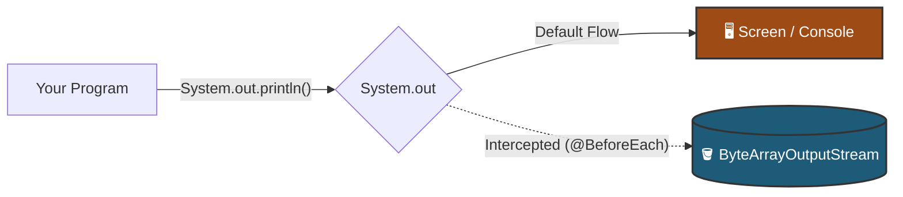
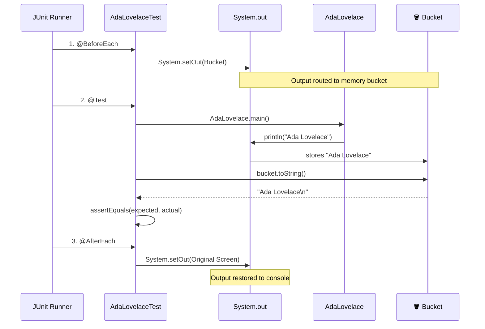

# Testing Console Output

> [!NOTE]
> You don't need to master this yet. You will formally learn testing in Part 2. This guide explains how to read the provided tests.

Most tests are simple: feed a method `2` and `3`, and check if it returns `5`. (See [MathExampleTest.java](file:///Users/ryner/Documents/Library/Programming/Java/Courses/MOOC/src/test/java/part01/s02printing/MathExampleTest.java) for a standard test).

But testing programs that only print text means intercepting the system's output. Open [AdaLovelaceTest.java](file:///Users/ryner/Documents/Library/Programming/Java/Courses/MOOC/src/test/java/part01/s02printing/AdaLovelaceTest.java) and follow the 4 annotated steps.

---

## 1. The Bucket (`ByteArrayOutputStream`)

By default, `System.out` flows directly to your screen. Our test code cannot read your screen. To fix this, we create a `ByteArrayOutputStream`—a memory bucket.

* **References:** 
  * [Oracle Docs: System.out](https://docs.oracle.com/en/java/javase/21/docs/api/java.base/java/lang/System.html#out) | [Baeldung: Testing System.out](https://www.baeldung.com/java-testing-system-out-println)
  * [Oracle Docs: ByteArrayOutputStream](https://docs.oracle.com/en/java/javase/21/docs/api/java.base/java/io/ByteArrayOutputStream.html) | [Baeldung: OutputStreams](https://www.baeldung.com/java-outputstream)

---

## 2. The Setup (`@BeforeEach`)

JUnit uses annotations (words starting with `@`) to know when to run specific code. The `@BeforeEach` method runs right before every test. In `AdaLovelaceTest`, we use it to hijack the `System.out` stream and route it into our bucket.

* **References:** [JUnit 5 User Guide](https://junit.org/junit5/docs/current/user-guide/#writing-tests-annotations) | [Baeldung: JUnit 5 Guide](https://www.baeldung.com/junit-5)

---

## 3. The Teardown (`@AfterEach`)

The `@AfterEach` method runs right after a test finishes. We must use it to restore `System.out` to its default state. If we forget, the stream stays hijacked and IntelliJ permanently stops printing to your console.

---

## 4. The Execution (`@Test`)

The `@Test` annotation flags the method that triggers your program and checks the result. 

This is the exact data flow when JUnit runs the test suite:

